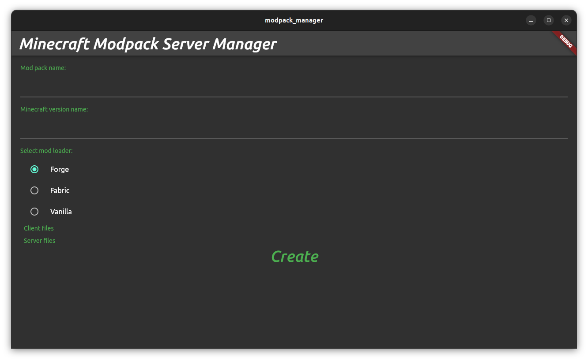

# Boberto MODPACK MANAGER

This is a refactor of Boberto MAUI version to Flutter version.

Why? Because i will part all the boberto ecosystem to Golang and Flutter. This is a personal change to separe my personal projects of professional projects.

